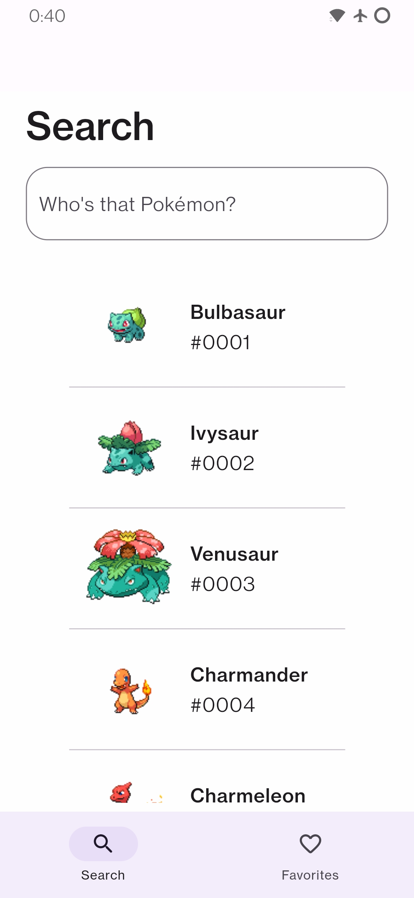
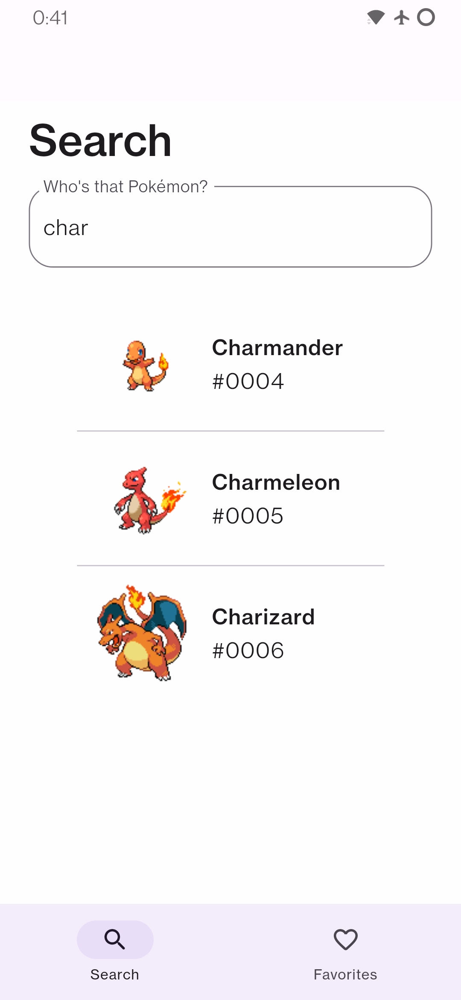
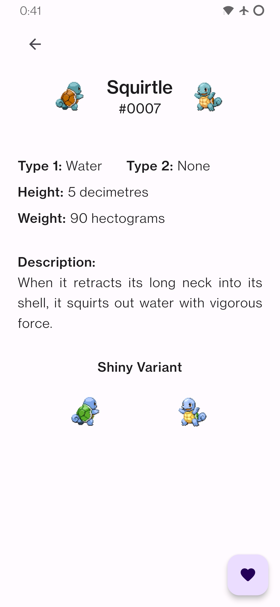
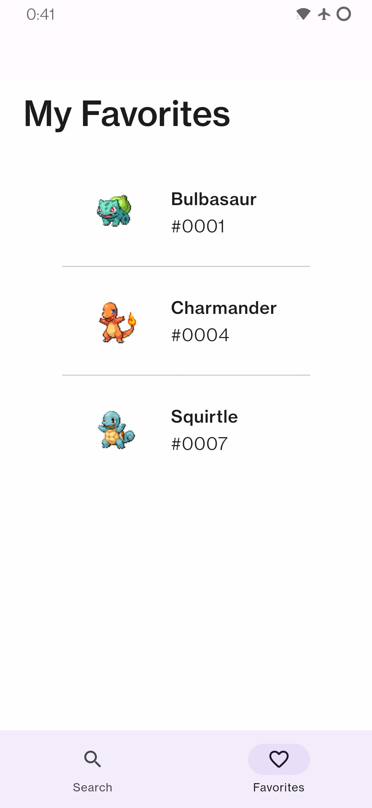

# Flutter App: My Monsters

A Pokémon app that serves as a simplified Pokédex. It shows a list of Pokémon so you can search and click the one you like to see a more detailed view with extra information.
There is a favorite feature that allows the user to set their favorites that are shown in the favorites view. It has data persistence, so the user can return to their favorites.

 
#### 🦖 **Search View** 🦖️

This view shows the image, name, and Pokédex number of the Pokémon searched. The list refreshes in real-time as the user writes in the search bar.

#### 👁 **Details View** 👁

When the user clicks on a Pokémon, this view will be shown with more information about it. In this view the user will also find a button, clicking on it will "favorite" the Pokémon.

#### ❤️ **Favorites** ❤️

Any Pokémon that has been marked as a favorite by the user will be shown here.

#### 👆 **Tab Bar** 👆

A tab bar to move between the search view and the favorite view.

#### 🔜 **To Do** 🔜

Known issues and functionalities that will come in the next version:

- Known issue: Manage app in no connection scenarios.
- Known issue: Introduce pagination to manage large Pokémon lists.
- Known issue: When marking as a favorite, check if the Pokémon is not already in favorites.
- Feature: Use the https://pokeapi.co/ to get the data of the Pokémon.
